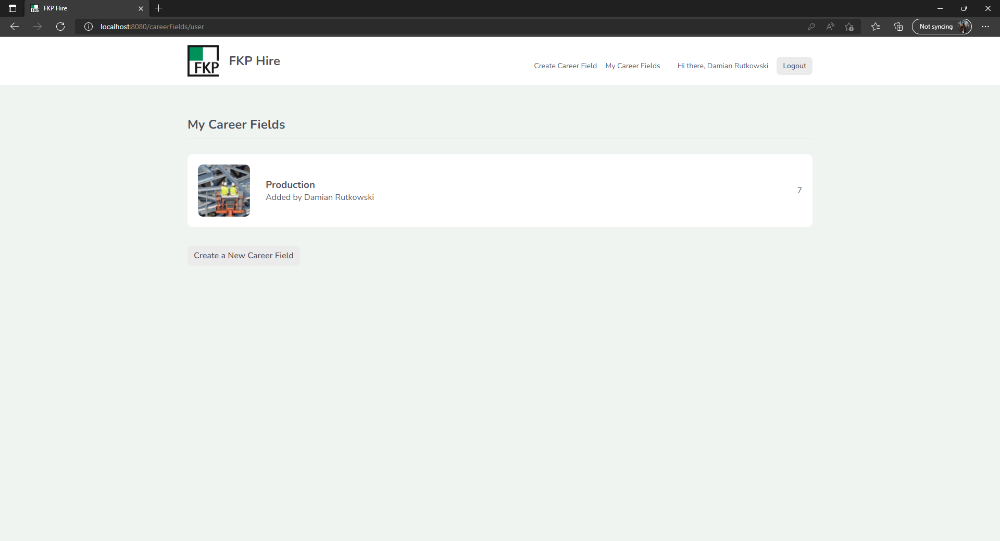

# FKP Hire

"Managing the employee recruitment process - design and realization of a web application" - my bachelor's diploma thesis - a project created using JavaScript framework - Vue.js and Google Firebase as BaaS.

## Table of contents
* [General info](#general-info)
* [Preview of the app](#preview-of-the-app)
* [Status](#status)
* [Author](#author)

## General info

* Tailored to a company - FKP Hire application is designed for the recruitment department at a company called 
FKP(department located in Poland) & FKN(department located in Germany),
* Combines programming with management sciences,
* Built following Web Development Life Cycle,
* FKP Hire allows you to collect and update data on current vacancies in the company by the recruitment 
department, responsible for acquiring candidates from various industries with an emphasis on the 
manufacturing industry,
* It takes into account a variety of career fields and allows the recruitment department to create job 
descriptions,
* The application is a comprehensive solution, adapted to the company's requirements and facilitating the 
collection of all vacancies and their descriptions,
* The website allows the user to create and log into their account,
* The user can add, edit, and delete both the entire career field and individual professions stored in it.

## Preview of the app

This application aims to be an intuitive tool for everyday use by the recruitment department at FKP.

### Login view:
  
Special placeholders have been added to the fields to help the user understand what the form expects. In this case, it is the email and password. Entering this data allows the person to log in to the application after pressing the "Log in" button.   
   
 ### Message after entering incorrect data when logging in:
    
If the login details are incorrect, an appropriate error message will be displayed. In this case, it is "Incorrect login credentials".   
   
 ### Signup view:
  
Another view added to the application was Signup.vue, which allows the user to create a user account. This form is very similar to the login form created earlier. In addition to the "Email" and "Password" fields, a field called "Display name" has also been added, allowing the user to add a username.   
   
 ### View of the form for creating a career field:
   
The user is able to add a title, description and upload a picture of the career field. In addition, only the logged in person has this option. It is worth noting that the route changes depending on which subpage the person is on. In this case, it is /careerFields/create.   
   
 ### View of the career fields that belong to the logged in user:
  
In the picture above, there is a button called "Create a New Career Field". Clicking on it will take the user to the tab where you can create a new career field (/careerFields/create).   
   
 ### A message informing about the incorrect extension of the uploaded file:
  
When creating a career, the application checks whether the added file has the appropriate extensions. It must be a graphic file in PNG or JPG format.   
   
 ### FKP Hire home page view:  
  
### Animation after hovering over the selected career field:
  
A special animation has been added that increases the size of the block hovered over by the user.   
   
 ### Career field details view and job list:   
  
  
 ### Form to add a new job offer:
  
After pressing the "Add Job Offer" button, the user is presented with a form by means of which he can add a new position, including its title and description/requirements.   
   
 ### A view of career field details from the perspective of a non-author user:
  
The figure above shows the same career field and positions but from the perspective of a user who is not the author of the positions. As you can see, Mrs. Alison is unable to add a new position in this field, edit or delete existing data.   
   
 ### Editing the selected career field:
  
When the user wants to change the data, he is transferred to a new tab about the route: /careerFields/edit/:id. The edit form is visually very similar to other forms used in the application. After pressing the "Save" button, the page is automatically refreshed, and the changed information is immediately visible in the career field details tab.   
   
 ### FKP company logo on the FKP Hire application tab:
  
The entire application was created meticulously, taking care of the smallest details. Throughout the project, care was taken to ensure the cleanliness and transparency of the code on the backend side and the visually friendly, color-coordinated frontend. One example is the company logo placed on the tab of the web application.   
  
 ### FKP Hire application URL after deployment:
  
The image above shows the deployed application and the new URL. After logging in/registering the user, all functionalities are available and work as originally intended.   
  
 
## Status
The project you can find here is fully operational. Nonetheless, more functionalities might be added in the foreseeable future. 

## Author
Created by [DrelaDominika](https://github.com/DrelaDominika) - feel free to contact me!
